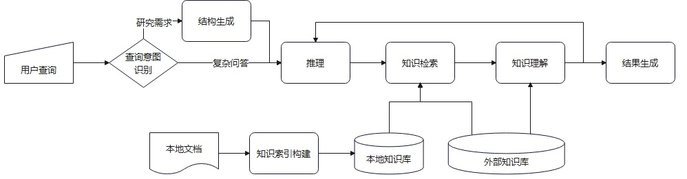
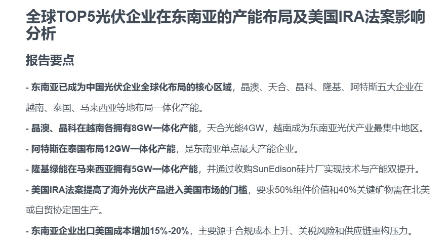
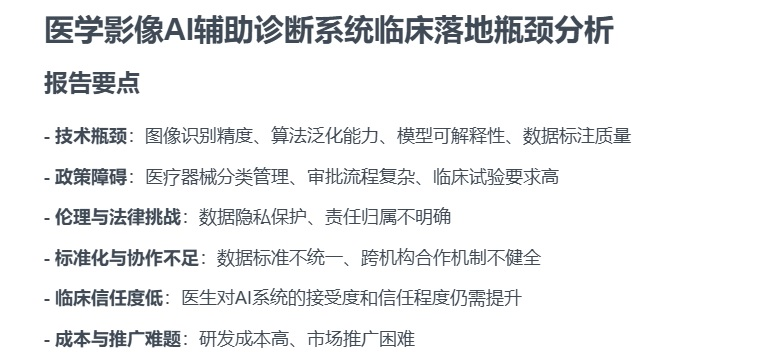

# Jiuwen-DeepSearch 九问深度搜索

[简体中文](./README.md) | [English](./README_en.md)


## 📑 目录
- [💡 九问深度搜索是什么](#九问深度搜索是什么)
- [🎬 演示案例](#演示案例)
- [🔥 最新版本特性](#最新版本特性)
- [🚀 快速开始](#快速开始)
- [🔍 搜索引擎支持](#搜索引擎支持)
- [🌟 核心特性](#核心特性)
- [🔧 执行流程](#执行流程)
- [🏗️ API参考](#api参考)
- [📚 版本特性追踪](#版本特性追踪)
- [📜 许可证](#许可证)
- [🙏 致谢](#致谢)
- [❓ 常见问题FAQ](#常见问题faq)


## 九问深度搜索是什么？

---
**Jiuwen-DeepSearch** 九问深度搜索是一款知识增强的深度检索与研究引擎。我们的目标是利用结构化知识及大模型，融合各种工具，提供精准、灵活、高效深度搜索及研究能力。我们支持不同数据格式的领域知识库接入，支持多种检索模式的选择，并通过知识增强的查询规划及反思，提供可靠、可溯源答案及报告。


## 演示案例

---
- Query1：比较全球Top5光伏企业在东南亚的产能布局，量化分析美国IRA法案对其海外供应链成本的影响


详见：[报告全文](./examples/全球TOP5光伏企业在东南亚的产能布局及美国IRA法案影响分析.md)

-  Query2：分析医学影像AI辅助诊断系统的临床落地瓶颈

 详见：[报告全文](./examples/医学影像AI辅助诊断系统临床落地瓶颈分析.md)


## 最新版本特性

---
- 新增outline节点，实现报告大纲生成
- 支持基于导入的报告自动提取报告模板
- 规划节点增加基于用户查询与章节任务生成搜索计划
- 在搜索节点引入查询改写功能，支持对改写后的多个查询进行检索和结果融合
- 增加搜索结果切分及按照分块的相关性筛选

更多特性详见： [Jiuwen-deepsearch release notes](./docs/release_notes.md)

## 快速开始

---
### 环境要求
- Python 3.12+
- 推荐工具：`uv`

### 安装步骤
```bash
# 克隆仓库
git clone https://gitee.com/openeuler/jiuwen-deepsearch.git
cd jiuwen-deepsearch

# 安装依赖库
uv sync

# 配置所调用的LLM和搜索引擎
# 调用大模型要求兼容OpenAI Chat Completions接口
#·LLM_BASIC_BASE_URL : 调用大模型的url
#·LLM_BASIC_MODEL : 大模型的名字
#·LLM_BASIC_API_KEY : 调用大模型所需的API Key
#·TAVILY_API_KEY : 外部搜索引擎的API接口
cp .env.example .env

# 构建工程所需的配置项
#·log_file : 运行日志
#·max_plan_executed_num : 最多执行的规划次数
#·max_report_generated_num : 最多生成的报告份数
#·recursion_limit : 单轮的最大递归深度
#·max_task_num : 每次任务的规划上限
#·max_search_results : 搜索结果的保留条数
#·max_crawl_length : 单页抓取字数的上限
cp service.yaml.example service.yaml
```
### 控制台用户界面
可以使用本地命令行运行项目
```bash
# 运行命令
uv run main.py query (例：uv run main.py 今天杭州的天气怎么样)
```

### 启动Web服务，通过Http接口调用
可以使用本地命令行运行项目
```bash
# 运行命令
uv run start_server.py IP port (例：uv run start_server.py --host 127.0.0.1 -p 8888)
```

## 搜索引擎支持

---
### 网页搜索
- **Tavily**  ：允许用户通过API接口获取搜索结果
    + 需要在.env配置TAVILY_API_KEY变量
    + 注册网址：https://app.tavily.com/home
- **Bing**：集成了Bing Search API执行网络搜索
    + 需要在.env配置BING_SUBSCRIPTION_KEY变量
    + 注册网址：http://portal.azure.com/
- **Google**：集成了Google Search API执行网络搜索
    + 需要在.env配置GOOGLE_API_KEY变量
- **DuckDuckGo**：支持隐私保护的搜索引擎
    + 无需API KEY
- **arXiv**：集成了arXiv Search API，可访问学术论文
    + 无需API KEY
- **Brave Search**：集成Brave Search API执行网络搜索，隐私友好型搜索
    + 需要在.env配置BRAVE_SEARCH_API_KEY变量
    + 注册网址：https://brave.com/search/api/
- **PubMed**：生物文献数据库的搜索
    + 需要在.env配置PUBMED_SEARCH_API_KEY变量
    + 注册网址：https://pubmed.ncbi.nlm.nih.gov/
- **Jina Search**：集成了Jina Search API执行网络搜索
    + 需要在.env配置JINA_API_KEY变量
    + 注册网址：https://jina.ai/


### 本地知识库搜索
支持2种本地知识库搜索，并支持扩展。需要在.env文件配置选择的本地知识库搜索及必要的API KEY：

- **RAGFlow**：开源的本地知识库搜索引擎，基于深度文档理解的检索增强生成工具。支持本地部署服务，构建本地知识库和文档检索。
    + 需要在.env配置RAGFLOW_API_URL和RAGFLOE_API_KEY变量
    + 开源仓库地址：https://github.com/infiniflow/ragflow/
    + 提供文档检索API，数据库和文档库展示API

- **Graph-Retriever**：自研的图结构增强型本地检索系统，基于文本嵌入与知识三元组（entity-relation-entity）构建的 Graph-RAG 引擎。支持本地部署，用于构建语义丰富的本地知识图谱检索系统。
    + 需要在 .env 文件中配置GRAPH_RETRIEVER_ES_URL（Elasticsearch 服务地址）、GRAPH_RETRIEVER_TEXT_INDEX（文本块的索引名称）、GRAPH_RETRIEVER_TRIPLE_INDEX（知识三元组的索引名称）变量。

在.env文件中配置选择的本地知识库搜索和对应的API KEY，以RAGFlow为例：

```
LOCAL_SEARCH_TOOL=rag_flow
RAGFLOW_API_URL="http//xxx"
RAGFLOW_API_KEY="ragflow-xxx"
```

## 核心特性

---
- **精准融合检索**
    + 支持对于通用网页及本地知识库的深度检索与研究。
    + 支持基于关键词、向量、图及融合等多种检索模式，并可配置选择。
- **知识增强**
    + 支持基于知识库的静态知识构建与基于检索结果的动态知识构建，通过图检索与推理提升召回率。
    + 通过动态知识提炼与压缩，提升上下文质量并降低大模型消耗。

- **开放、兼容**
    + 封装多种流行大模型接口， 如DeepSeek，OpenAI，Qwen等
    + 对接多种搜索工具，如网页搜索、代码执行、爬虫等，支持MCP模式。
    + 本地知识库接入支持多种文件类型，如 Word 文档、PPT、excel 表格、txt 文件、图片、PDF等。

- **高质量报告**
    + 支持兼顾深度与广度、专业排版，可视化数据报告
    + 支持Markdown，html，ppt等多种报告格式
    + 报告内容可溯源检索内容

## 执行流程

---
本系统实现智能化深度研究的流程，基于用户的报告生成需求，进行多次全面的网络信息检索和/或代码执行，通过不断总结推理以获取满足报告撰写的必要信息后，为用户提供内容丰富的研究报告。


## API参考

---
### research接口

#### 请求结构
| 字段名 | 字段类型 | 字段描述 |
|:-------: |:-------: |:------: |
| messages | str | 用户查询内容 |
| local_datasets | Optional[List[str]] | 需要查询的本地知识库表uri |
| session_id | Optional[str] | 会话id |
| max_plan_iterations | Optional[int] | 最大迭代次数 |
| max_step_num | Optional[int] | 每次迭代计划的步数 |
| report_style | str | 生成报告的风格 |
| report_type | str | 生成报告的类型 |

#### 返回结构

| 字段名 | 字段类型 | 字段描述 |
|:-------: |:-------: |:------: |
| session_id | str | 会话ID |
|agent | str | 消息的agent名称 |
| id | str | 消息ID |
| role | str | 消息的角色 |
| content | str | 消息内容 |
| message_type | str | 消息类型 |

#### 样例参考

```http
# 请求
POST http://127.0.0.1:6000/api/research HTTP/1.1
Content-Type: application/json
{
 "message": "hello", 
 "local_datasets": "null", 
 "session_id": "null", 
 "max_plan_iterations": "5", 
 "max_step_num": "10", 
 "report_style": "null",
 "report_type": "null"
}
```

```json
# 响应
{
 "session_id": "null", 
 "agent": "entry", 
 "id": "3f1dfac2-db30-4d8a-b02d-d955316e7721", 
 "role": "assistant", 
 "content": "Hello! How can I assist you today?", 
 "message_type": "AIMessage"
}
```

### graph_retrieve 接口

#### 请求结构

| 字段名 | 字段类型 | 字段描述 |
|--------|----------|----------|
| query | str | 用户的自然语言查询 |
| top_k| Optional[int] | 返回最相关的结果条数，默认 5 |
| use_triple_index | Optional[bool]| 是否启用三元组图谱检索，默认 true |
| use_text_index | Optional[bool]| 是否启用文本块向量检索，默认 true |
| es_url| Optional[str] | Elasticsearch 服务地址，若未提供则读取 .env配置 |
| text_index | Optional[str] | 文本索引名称，默认读取 .env |
| triple_index | Optional[str]| 三元组索引名称，默认读取 .env |

#### 返回结构

| 字段名 | 字段类型 | 字段描述 |
|--------|----------|----------|
| query | str | 用户原始查询 |
| mode | str | 实际使用的检索模式（text / triple / hybrid） |
| top_k | int | 返回结果数量 |
| results | List[dict] | 检索结果，每项包含分数、来源、内容等 |

#### 请求示例

```
POST http://127.0.0.1:6000/api/graph_retrieve HTTP/1.1
Content-Type: application/json

{
  "query": "Explain the relationship between Kubernetes and container orchestration.",
  "top_k": 3,
  "use_triple_index": true,
  "use_text_index": true
}
```

#### 响应示例

```json
{
  "query": "Explain the relationship between Kubernetes and container orchestration.",
  "mode": "hybrid",
  "top_k": 3,
  "results": [
    {
      "score": 0.92,
      "source": "text_index",
      "content": "Kubernetes is an open-source platform designed to automate deploying, scaling, and operating application containers."
    },
    {
      "score": 0.88,
      "source": "triple_index",
      "content": "(Kubernetes, supports, container orchestration)"
    },
    {
      "score": 0.81,
      "source": "text_index",
      "content": "Container orchestration allows you to manage the lifecycle of containers, and Kubernetes is one of the most popular tools for that purpose."
    }
  ]
}
```

### LLMWrapper接口
LLMWrapper封装langchain_openai.ChatOpenAI和langchain_deepseek.ChatDeepSeek，参数从配置文件.env获取，返回ChatOpenAI或ChatDeepSeek实例。
#### 构造参数
|   字段名    |          字段类型           |                           字段描述                           |
| :---------: | :-------------------------: | :----------------------------------------------------------: |
| base_url | string | LLM API的根URL |
| model | string | 调用模型名称 |
| api_key | string | LLM API的密钥，用于请求身份认证 |
| api_type | string | LLM API的类型，支持openai和deepseek，默认openai |

#### 样例参考

```python
from langchain_core.messages import HumanMessage
from src.llm.llm_wrapper import LLMWrapper

client = LLMWrapper("basic")
msgs = [HumanMessage(content="Hello")]
resp = client.invoke(msgs)
```


### MultiServerMCPClient接口

#### 请求结构
| 字段名 | 字段类型 | 字段描述 |
|:-------: |:-------: |:------: |
| connections| dict[str, Connection]或None | 映射服务器名称到连接配置的字典。如果为 None则不建立初始连接。 |

### 样例参考

#### 工具调用时启动新会话

```python
from langchain_mcp_adapters.client import MultiServerMCPClient

client = MultiServerMCPClient(
    {
        "math": {
            "command": "python",
            # Make sure to update to the full absolute path to your math_server.py file
            "args": ["/path/to/math_server.py"],
            "transport": "stdio",
        },
        "weather": {
            # Make sure you start your weather server on port 8000
            "url": "http://localhost:8000/mcp",
            "transport": "streamable_http",
        }
    }
)
all_tools = await client.get_tools()
```

#### 显式启动目标会话

```python
from langchain_mcp_adapters.client import MultiServerMCPClient
from langchain_mcp_adapters.tools import load_mcp_tools

client = MultiServerMCPClient({...})
async with client.session("math") as session:
    tools = await load_mcp_tools(session)
```

## 版本特性追踪

---
各版本特性详见 [Jiuwen-deepsearch release notes](./docs/release_notes.md) 
## 许可证

---
**Jiuwen-DeepSearch**使用木兰协议(Mulan PSL)，木兰协议是由中国开放原子开源基金会发布的开源许可证,旨在鼓励中国开源社区的发展。该协议强调代码共享和社区贡献,允许用户自由使用、修改和分发代码,同时要求在分发时保留原始版权声明和许可证文本,并标明修改内容。请见 [License](https://gitee.com/openeuler/jiuwen-deepsearch/blob/master/LICENSE)

## 致谢

---
**Jiuwen-DeepSearch**的构建离不开开源社区的卓越成果。我们由衷感谢所有为**Jiuwen-DeepSearch**的实现提供支持的项目及贡献者，正是他们的努力，才让本项目得以落地。

特别向以下项目致以诚挚的谢意，感谢它们作出的宝贵贡献：

- [LangChain](https://github.com/langchain-ai/langchain)：其强大的大语言模型交互框架为我们提供了灵活的链与代理能力，极大的简化了我们从prompt设计到多步骤任务编排的全流程开发。
- [LangGraph](https://github.com/langchain-ai/langgraph) ：作为LangChain生态的重要延伸，其基于状态机的多智能体协作模型，为项目中的任务调度及动态流程控制提供了关键的技术底座。
- [DeerFlow](https://github.com/bytedance/deer-flow)： 其提出的DeepResearch流程很好的串联了多轮查询、多轮推理及报告生成流程。DeerFlow在技术探索与开源分享上的付出，为深度搜索方向提供了宝贵的参考范式，为我们提供了宝贵的思路与实践经验。
- [RAGFlow](http://url.com) ：其提供的本地知识库能力使得项目能实现对用户本地文档、定制化数据的精准检索与智能分析，为垂域场景下的知识注入提供了坚实的底座。

特别感谢上述项目的开发团队及所有社区贡献者，正是你们的持续迭代、文档完善与开源共享，让**Jiuwen-DeepSearch**能够站在巨人的肩膀上快速成长。这份开源精神也将激励我们在迭代中保持开放，期待未来能为社区贡献更多价值。

## 常见问题FAQ

---
常见问题详见 [FAQ列表](./docs/release_notes.md) 